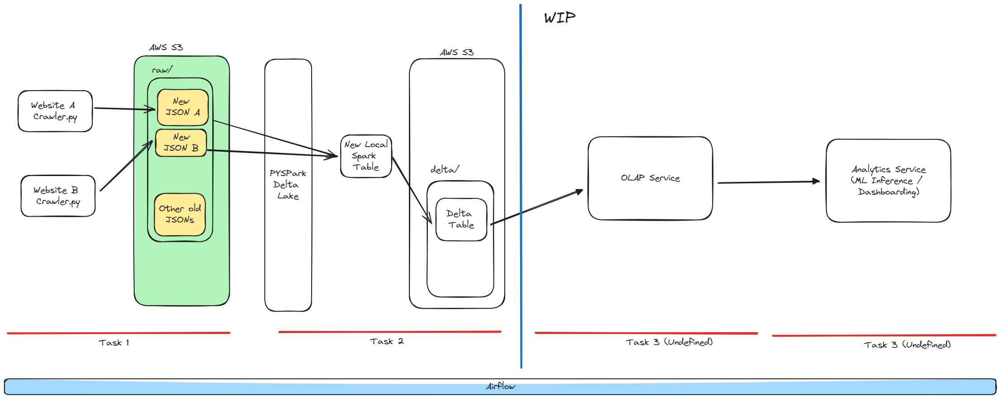

# Find My Home

## Project Summary

This is the full data enginerring lifecycle project. The project is to collect the data from the web (e.g. Zoopla), clean the data, and store the data in the database. This processed data will be used for the analysis and visualization. ALl these tasks will be automated using the Airflow. This is a rough sketch of the project.

## Motivation

I am planning to buy my own home very soon (fingers crossed) but I would like to know the trends of the property market based on the facts (i.e. data) not by the opinions of the real estate agents. This is a good opportunity to learn the full data engineering lifecycle and apply the skills to the real world problem. (I know this is not the perfect / over-engineered / poorly designed project but I would like to learn the full lifecycle of the data engineering.)

## Data Source

- Zoopla Website

## Data Engineering Lifecycle

1. Data Ingestion
    - Collect the data from the web using Python crawler script
    - Load this JSON data to the S3 bucket (Data lake)
2. Data Transformation
    - Clean the data
    - Convert data as delta table and store the table in S3 bucket
3. Serving Data
    - Load the data from the S3 bucket to the OLAP service. (e.g. Redshift)
        - Ideally, I would like to deploy Apache Druid with kube cluster
    - Create the dashboard using the BI tool (e.g. Apache Superset)
    - Apply super simple MLs to predict the price of the property
4. Orchestration / Automate the pipeline
    - Use Apache Airflow to automate the pipeline

## Tech Stack

### Programming

- Python

### Data Storage / Processing

- AWS S3
- Apache Spark / Delta Lake
- Apache Druid (TBD)

### Data Orchestration

- Apache Airflow

### Data Serving

- Apache Superset (TBD)
